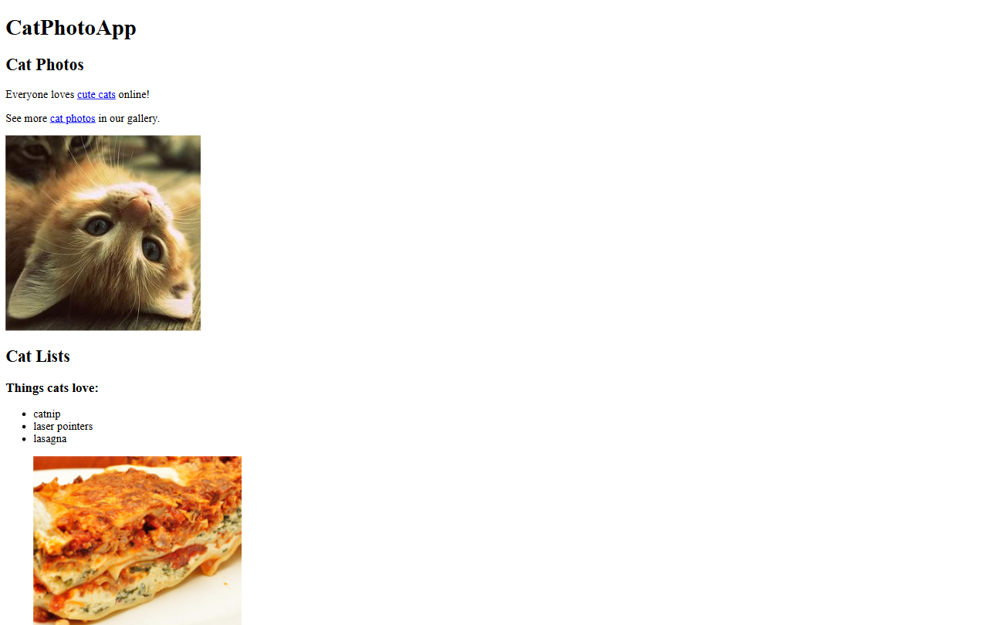

# Cat Photos App | FCC Responsive Web Design Certification

**Project 1/20**

A simple HTML project featuring a cat-themed webpage. Built as the first project for the freeCodeCamp Responsive Web Design Certification. 🐱

---

## 📚 Table of Contents

- [🔎 Overview](#-overview)
  - [📸 Screenshot](#-screenshot)
  - [🔗 Links](#-links)
  - [📌 Features](#-features)
- [🧠 My process](#-my-process)
  - [🛠️ Built with](#-built-with)
  - [🔜 Next Project](#-next-project)
- [👤 Author](#-author)
  - [🌐 Connect with Me](#-connect-with-me)
  - [💻 Coding Profiles](#-coding-profiles)

---

## 🔎 Overview

### 📸 Screenshot

### 🔗 Links

 - [🔴 Live Demo](https://dalascript.github.io/cat-photos-app/)
 - [🗂️ GitHub Repository](https://github.com/DalaScript/cat-photos-app)

### 📌 Features

 - ✅ Pure HTML structure
 - ✅ Multiple sections using semantic tags (`<main>`, `<section>`, `<footer>`)
 - ✅ A cat image gallery with clickable links
 - ✅ Lists of things cats love and hate
 - ✅ Basic form with radio buttons, checkboxes, and text input
 - ✅ Usage of `fieldset`, `legend`, and form accessibility practices
 - ✅ External and internal links
 - ✅ Clean and minimal HTML layout

## 🧠 My Process

### 🛠️ Built with

- HTML5
- Accessibility best practices
- Semantic HTML elements

### 🔜 Next Project

 - Cafe Menu → [View Repository](https://github.com/DalaScript/cafe-menu)

---

## 👤 Author

### 🌐 Connect with Me

 - [Instagram](https://www.instagram.com/DalaScript)
 - [YouTube](https://www.youtube.com/@DalaScript)

### 💻 Coding Profiles

 - [freeCodeCamp](https://www.freecodecamp.org/DalaScript)
 - [FrontendMentor](https://www.frontendmentor.io/profile/DalaScript)
 - [GitHub](https://github.com/DalaScript)

*🙌 Thanks for checking out my project! More coming soon. Stay tuned 🚀*